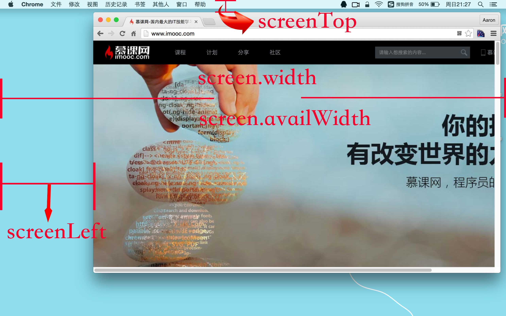

# window
下面四个属性只读，随浏览器窗口大小变化,支持IE9及以上浏览器

window.innerHeight

>浏览器窗口的视口(viewport)高度（单位：像素）；如果有水平滚动条，也包括滚动条高度。


window.innerWidth

>浏览器视口(viewport）宽度（单位：像素），如果存在垂直滚动条则包括它.
window.outerHeight

window.outerHeight
> 获取整个浏览器窗口的高度（单位：像素），包括侧边栏（如果存在）、窗口镶边（window chrome）和窗口调正边框（window resizing borders/handles）


window.outerWidth 
>获取浏览器窗口外部的宽度。表示整个浏览器窗口的宽度，包括侧边栏（如果存在）、窗口镶边（window chrome）和调正窗口大小的边框（window resizing borders/handles）


# screen
屏幕的宽高，不随浏览器窗口大小变化
1. window.screen.height

获取设备屏幕的高度，是不关浏览器或者顶部工具栏跟底部工具栏的高度的

2. window.screen.availHeight

屏幕高度减掉顶部工具栏跟底部工具栏的高度

3. window.screen.width

设备屏幕的宽度，是不关浏览器或者左右工具栏的宽度的

4. window.screen.availHeight

电脑屏幕宽度减掉左右工具栏的宽度




# 元素
```
clientWidth:  width + padding-left + padding-right
clientHeight: height + padding-top + padding-right
offsetWidth:  width + padding-left +  padding-right + border-left + border-right
offsetHeight: width + padding-left + padding-right + border-top + border-bottom
scrollWidth: 对象的实际内容的宽度，不包边线宽度，会随对象中内容超过可视区后而变大
scrollHeight: 对象的实际内容的高度，不包边线高度，会随对象中内容超过可视区后而变大
```


offsetLeft:
offsetTop:

# document.documentElement和document.body
document.body指的是html节点中的body节点
document.documentElement指的是文档的根节点，即html节点

`
document.body.clientWidth ==> body对象宽度(不包括border)

document.body.clientHeight ==> body对象高度(不包括border)

document.documentElement.clientWidth ==> 可见区域宽度(不包括滚动条) = window.innerWidth - 垂直滚动条的宽度

document.documentElement.clientHeight ==> 可见区域高度(不包括滚动条) = window.innerHeight - 水平滚动条的高度
` 

所以要获取网页可视区的高度，使用`document.documentElement.clientHeight`

